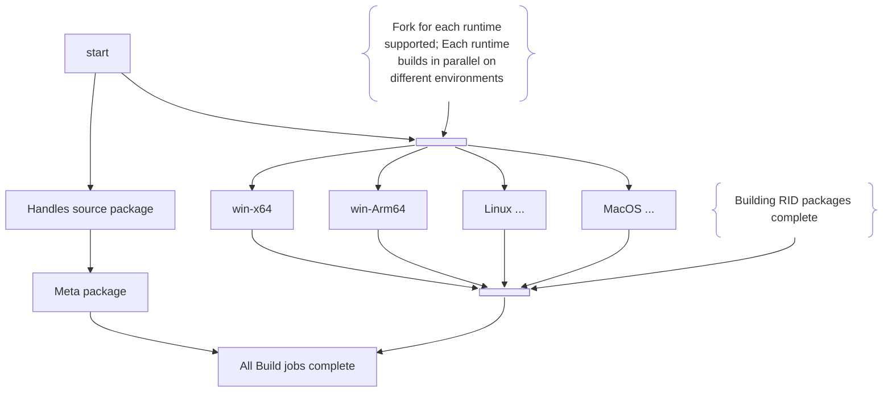

# LIBLLVM Extended LLVM-C Dynamic library
This folder contains the low level LLVM native dynamic library support. It requires specialized
build ordering and processing, which is handled by the PowerShell scripts.

## Status

### Latest Download
#### Released NuGet Packages
|Package Name | Badge |
|-------------|-------|
| Ubiquity.NET.LibLLVM (Meta package)|  |
| Ubiquity.NET.LibLLVM-win-x64 |  |

#### PR/CI build packages
Packages for CI and PR builds are NOT published/released to NuGet.org (nor any other packaging
service). Instead the are available as artifacts from GitHub directly. The [Actions](https://github.com/UbiquityDotNET/Llvm.Libs/actions)
tab contains a full list of all work-flow runs and the artifacts from each are available from the
links for each run. (NOTE: GitHub limits the lifetime or artifacts to a maximum of 90 days, though
this repository may limit that to a lower number, downloading packages built is useful for testing.
But, bear in mind this mechanism is NOT available for long term use so you should download shortly
after the PR/CI build completes.)

##### Why not a CI package?
Simply put - it's just too much of a PITA to setup and manage that it isn't worth the time. The
overhead and costs of setting up such a thing for these packages (and the ability to delete
pre-released versions after a period of time) is too high or not even plausible. Maybe, the ROI on
that will change at some point, but as of right now, it's just not worth the bother. Download the
artifacts you are interested in to your own local file "share" location and use that.

## About
This repo provides runtime dynamic libraries for use of an extended C API for LLVM "bindings" in
other languages/run-times (.NET, and Windows in general, would call these "projections").

LLVM is a large collection of libraries for building compiler back-ends that support a great deal
of customization and extensibility. Using LLVM either requires building the entire source tree or
access to pre-built libraries. The source is available, but building a full set of libraries for
multiple platforms and configurations (e.g. x86-Release, x64-Debug, etc...) can take significant
time, and use a LOT of resources, which can be an issue for an automated build. Many Free for OSS
project build services like [AppVeyor](http://AppVeyor.com) limit the total run time for any given
build. Therefore, building the full source won't work there. In addition to the compilation times,
the full size of the debug binaries and symbols output is very large, if packaged as a NuGet package
it exceeds the size limits of all known public release NuGet galleries.

Thus, this repository includes building the actual dynamic libraries for run-times and targets
supported for RELEASE (No symbols) ONLY. If symbols are needed for local debugging, then those are
built locally.

>[!NOTE]
> It is VERY rare to need to debug into the LLVM libraries themselves. So much so that this is
> mostly a theoretical exercise.  
> Building the extension DLL with debugging is fully supported, and used heavily to debug new
> additions of the extension APIs.

>[!IMPORTANT]
> This library exposes a `C` ABI as that is the ONLY stable ABI for x-plat and x-language use. C++
> does NOT provide a stable ABI for exported use, even for other C++ consumption. While *nix users
> will often question, or outright "flame", that claim because of common use of shared libraries,
> the reality is they are only "getting away with it" because they are using the same compiler +
> linker +  runtime libraries in most cases. However, as soon as you have mismatches of any of
> those elements things go south REAL fast and in surprising ways for anyone used to it all just
> working. ( See this [reddit](https://www.reddit.com/r/cpp/comments/1336m2s/does_c_have_a_stable_abi_or_not/?rdt=46229)
> discussion for more details.) Thus, for maximum flexibility and compatibility, this exposes ONLY
> a stable `C` ABI.

## Projects
### LlvmBindingsGenerator
This is the source generator for the windows DLL `exports.def` based on the LbLLCM extended C API headers.
interop code in Ubiquity.NET.Llvm.Interop. It uses CppSharp to parse the C or C++ headers and generates
the native library exports.g.def (For a Windows DLL).

This tool is generally only ***required*** once per Major LLVM release. (Though a Minor release
that adds new APIs would also warrant a new run) However, to ensure the code generation tool
itself isn't altered with a breaking change, the PowerShell script takes care of building and
running the generator when needed, even if nothing changes in the end. This is run on every
automated build so that the output is usable in subsequent steps of the complete build. 

### LibLLVM
This is the native project that creates the extended LLVM-C API as an actual dynamic library.
At present only Windows x64 is supported, though other configurations are plausible with
additional build steps in the PowerShell script to build for other platforms. The extensions are
configured to build with high C++ conformance mode, so they should readily build without much
modification for other platforms given the appropriate build infrastructure is set up. (See
additional comments on the [automated build](#automated_build) below)

## Building the packages in this repo
The build relies on PowerShell scripts to handle most of the operations of building the libraries

### General requirements
There are some general steps that are required to successfully build the interop NuGet
package and a couple of different ways to go about completing them.
 1. Build LlvmBindingsGenerator
 2. Run LlvmBindingsGenerator to parse the llvm headers and the extended headers from the
    native LibLLVM
    1. This generates the linker DEF file used by the Windows variants of native library and therefore
       needs to run before the other projects are built. Generating the exports file ensures that it is
       always accurate and any functions declared in the headers are exported so that the linker generates
       an error for any missing implementation(s).
        1. This step is run once for each RID+target combination.
        2. There is an [effort](https://github.com/llvm/llvm-project/issues/109483) ongoing in
           LLVM to support the declaration of APIs as exported (via the `LLVM_C_ABI` macro) but
           that is not yet complete.
            1. As of this release that's only applied on the target specific registration/initializer
               methods.
            2. Even when complete this only eliminates the need to generate the DEF file as ideally
               every exported API would include the `LLVM_C_ABI` marker.
                1. It might even need some form of global disable to prevent `LLVM_ABI` C++ types or
                   methods from default exporting and ONLY allow `LLVM_C_ABI' exports. It isn't clear
                   what the story is going to be there.
 3. Build the LLVM libraries for all supported run-times (OS+arch) in release form. This helps to ensure
    an automated build is usable by limiting the resources needed for a given step.
 4. Build LibLLVM as a dynamic library from the libs for all supported run-times

### Automated build
The extended C dynamic libraries are built using the PowerShell `Build-LibLLVMAndPackage.ps1` script.
This script is required to correctly build the projects in an automated build as it isn't possible
to accomplish all the required steps in a standard project/solution. (OK, impossible is a bit strong
as creating custom targets and tasks could probably cover it but at the expense of greater
complexity). The script is pretty simple to use and understand. Additionally, x-plat future intentions
means that the MSBUILD and VCXproj would go away in favor of CMAKE+Ninja for the project and build.
(This project isn't there yet, but that's the intention at least)

>[!IMPORTANT]
> The ease of building multiple platforms is a relative concept and turns out to be MUCH
> more complicated than one might hope. In particular, is the build of all the required LLVM
> libraries needed to make a final LibLLVM. The full set (For a debug build with symbols) will
> generally exceed both the time and storage space limits of any OSS project automated build system
> like GitHub Actions, APPVEYOR, etc... Thus, the native libraries are currently limited to ONLY the
> release form without symbols. (If symbols are needed or desired then a LOCAL build is required
> to get them).  
> Each runtime is built as a single dynamic library exporting the extended C ABI. Each runtime is
> bundled as a single NUGET package. A single meta package is also created that simply references
> the individual runtime packages. Thus, a consumer of this library only needs to reference the one
> "meta" package `Ubiquity.NET.LibLLVM` to get all available run-times. (and potential future ones
> added in later releases)

>[!NOTE]
> As of this writing Windows x64 is still the only supported platform, but the general idea
> of how to handle cross platform support is coming in to place. So hopefully adding others
> will now be a LOT simpler going forward.

#### Build Diagram
The following diagram illustrates the basic idea on how this works:

##### handles source package
The generation of the handle types from the source exposes complexity and dependency of this
effort and that of the larger Ubiquity.NET.Llvm effort, which depends on this library. Originally,
the idea was to reduce the build of the LLVM libraries themselves (they were published as a zip
file and included symbols AND the header files) But, that approach has proven difficult to
maintain and a MAJOR hindrance to x-plat. Thus, a rework was done to build the runtime dynamic
library in this repo. Though that still leaves the header generation and the bindings generator
in a weird place. Since the NuGet package now only includes the final library for a runtime the
bindings generator isn't usable anywhere else and thus the "handle" generation must occur where
the LLVM headers are available. But, the generated source has dependencies on other base
types/helpers in the interop library... 

Thus, the usefulness of this project as a distinct repo is coming into question. [Currently the
bindings generator just builds a NuGet package with the source assuming use ONLY in the interop
library, but unifying the repositories, could eliminate that and make a number of inner loop
development scenarios simpler. Though, automated build times would dramatically increase as they
would need to re-build ALL of the LLVM source code for every such build...] (Ah the wonders of
trade-offs in engineering never cease... :nerd_face:)

#### Open issues for a truly x-plat build
1) The Library itself builds with VCXPROJ and MSBuild
    1. While the LLVM libraries are built with CMAKE + Ninja, the final library is currently built
       via a VCXPROJ. This will need to change to support a proper CMAKE build for the final
       library so it is used all up.
    2. While it may be tempting to implement that in such a way as to reference the `CMakeList.txt`
       of the libraries (to create a sort of project reference) that's not actually helpful in the
       real world for this code base.
        1. It is actually better to build the LLVM libraries distinct, that way for local loop
           work they are available as inputs to the MUCH shorter build of the final dynamic library.
           Most local development is on the extension APIs as the LLVM source is NOT modified in
           any way by this project. (This isn't a fork of LLVM, just a consumer) so it is more
           expedient for local development to support building ONLY the extensions. (Even a command
           that is otherwise a "clean" or "rebuild" should NOT delete the previously built LLVM
           libraries)
2) The build scripts themselves have numerous assumptions of the runtime.
    1. Currently such assumptions should be explicit in a test either skip things windows only or
       throw an error if additional platform work is needed.
        1. ***No guarantees*** as none if it is tested on anything other than a Windows machine but
           best effort was applied so the issues on that are hopefully small.
3) The build scripts are in PowerShell and MAY include aliases that are not the same (or even exist)
   on other platforms.
    1. The scripting has undergone a number of changes and most of these aliases should NOT exist
       but no formal scrub to ensure they are all removed has occurred.
4) NuGet package generation currently assumes a windows RID
    1. This is hopefully the simplest to overcome as dotnet.exe and MSBUILD of C#/NuGet projects
       is properly x-plat already. Thus, the targets need to leverage the available information
       about the runtime it is operating on to create the proper package.
        1. The projects are all created to use an MSBUILD property for the RID, so it is,
           hopefully, just a matter of dynamically updating/setting that property.
            1. This could be done using the scripts and a property param passed to the build or
               within the build as a property function or custom task. Whichever ends up simpler
               and easier to maintain.

