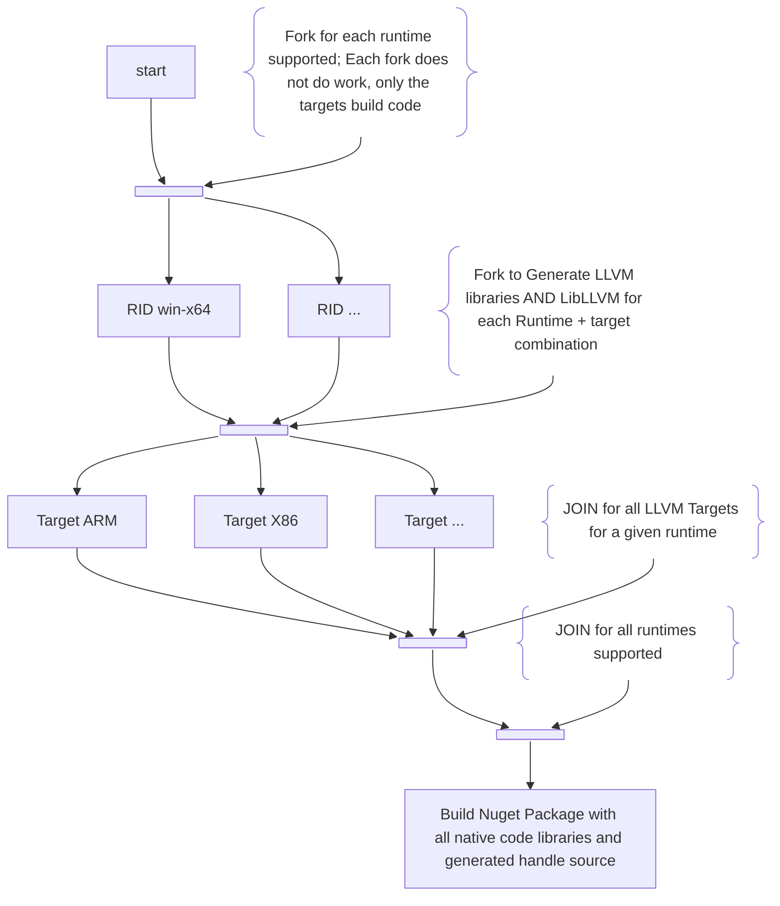

# LIBLLVM Extended LLVM-C Dynamic library
This folder contains the low level LLVM native dynamic library support. It requires specialized
build ordering and processing, which is handled by the PowerShell scripts.

## Latest Download
>[!TODO]
> update this to include all generated packages...

## About
LLVM is a large collection of libraries for building compiler back-ends that
supports a great deal of customization and extensibility. Using LLVM either
requires building the entire source tree or access to pre-built libraries.
The source is available, but building a full set of libraries for multiple
platforms and configurations (e.g. x86-Release, x64-Debug, etc...) can take
significant time, which can be an issue for an automated build. Many Free for
OSS project build services like [AppVeyor](http://AppVeyor.com) limit the total
run time for any given build. Therefore, building the full source won't work there.

In addition to the compilation times, the full size of the output is very large, if
packaged as a NuGet package it exceeds the size limits of all known public release
NuGet galleries. Thus, this repository includes building the actual dynamic libraries
for runtimes and targets supported. The build infrstructure for this is complex.

The nature of MSBUILD projects system and the .NET SDK for the generator drives the need for the
script, instead of more common solution/workspace dependencies or even MSBuild project to project
references. Unfortunately, due to the way multi-targeting is done in the newer C# SDK projects
ecen the project to project references don't work with C++. The VCXproj files don't have
msbuild targets for all the required .NET targets. Making that all work seamlessly in VS is
just plain hard work that has, thus far, not worked particularly well. Thus, the design here
uses a simpler PowerShell script that takes care of building the correct
platform+configuration+target framework combinations of each and finally builds the NuGet
package from the resulting binaries.

>[!IMPORTANT]
> This library exposes a `C` ABI as that is the ONLY stable ABI for x-plat and x-language
> use. C++ does NOT provide a stable ABI for exported use, even for other C++ consumption.
> While *nix users will often question that claim because of common use of shared libraries.
> They are only "getting away with it" because they are using the same compiler + linker +
> runtime libraries in most cases. However, as soon as you have mismatches of any of those
> elements things go south REAL fast and in surprising ways for anyone used to it all just
> working. Thus, for maximum flexibility and compatibility, this exposes ONLY a stable `C`
> ABI.

## Why A Distinct source generator
### Roslyn Source Generators - 'There be dragons there!'
Roslyn allows source generators directly in the compiler making for a feature similar to C++
template code generation AT compile time. However, there's a copule of BIG issue with that
for this particular code base. (And these distinctions are hard to get your head around for
those famliar with C++ templates)
1) Non-deterministic ordering
    - More specifically for this project there is no way to declare the dependency on
      outputs of one generator as the input for another. (They all see the same original
      source as input so they can run in parallel.)
2) Dependencies for project references
    - As the generators are not general purpose they are not published or produced as a
      NUGET package. They only would work as a project reference. But that creates a TON of
      problems for the binary runtime dependencies of source generators, which don't flow
      with them as project references...

Specifically, in this code, the built-in AOT aware P/Invoke generator that otherwise knows
nothing about the handle generation, needs to see and use the **OUTPUT** of the handle
source generation. (It's not just a run ordering problem as in the current Roslyn Source
generator design - ALL generators see the same input text!)  
[See: [Discussion on ordering and what a generator "sees"](https://github.com/dotnet/roslyn/discussions/57912#discussioncomment-1682779)]  
[See also: [Roslyn issue #57239](https://github.com/dotnet/roslyn/issues/57239)]

The interop code uses the the LibraryImportAttribute for AOT support of ALL of the interop
APIs declared. Thus, at compile time the interop source generator **MUST** be able to see
the types used, specifically, it must have access to the `NativeMarshalling` attribute for
all the handle types. Otherwise, it doesn't know how to marshal the type and bails out. It
is possible to "overcome" this with an explicit `MarshalUsingAttribute` on every parameter
or return type but that's tedious. Tedious typing is what soure generators and templates are
supposed to remove. Thus, this library will generate the handle sources **BEFORE** they are
compiled in the project. (Not to mention it also generates the exports.g.def used by the
native code. Thus, the generated source files will contain the marshalling attributes so
that the interop source generator knows how to generate the correct code.

>To be crystal clear - The problem is **NOT** one of generator run ordering, but on the
> ***dependency of outputs***. By design, Roslyn source generators can only see the original
> source input, never the output of another generator. Most don't, and never will, care. The
> handle generation, in this case does. Solving that generically in a performant fashion is
> a ***HARD*** problem indeed... Not guaranteed impossible, but so far no-one has come up
> with a good answer to the problem. Even C++ has this issue with templates+concepts+CRTP;
> and that language has had source generating templates as a direct part of the language for
> several decades now.  
> [See also: [Using the CRTP and C++20 Concepts to Enforce Contracts for Static Polymorphism](https://medium.com/@rogerbooth/using-the-crtp-and-c-20-concepts-to-enforce-contracts-for-static-polymorphism-a27d93111a75) ]  
> [See also: [Rules for Roslyn source generators](https://github.com/dotnet/roslyn/blob/main/docs/features/incremental-generators.cookbook.md)]

#### Alternate solutions considered and rejected
1) Running the source generator directly in the project
    1) This is where the problem of non-deterministic ordering and visibility of the
       generated code was discovered. Obviously (now anyway!) this won't work.
2) Use a source generator in a seperate assembly
    1) This solves the generator output dependency problem but introduces a new problem of
       how the build infrastructore for these types manage nuget versions.
    2) Additionally, this adds complexity of a second native dependency on the library
       exporting the native functionality. (Should there be two copies? How does code in
       each refer to the one instance?...)
3) Call the source generator from within this app to control the ordering
    1) This at least could get around the ordering/dpendency problem as it would guarantee
       the custom generator runs before the built-in one.
    2) However, this runs afoul of the binary dependency problem... Not 100% insurmountable
       but the number of caveats on the Roslyn Source Generator side of things grows to a
       significant factor. This also complicates all parts of the build to where it isn't
       worth the effort.

### The final choice
Keep using this LlvmBindingsGenerator as a generator for the export file on Windows and the
handle types for all runtimes. This used to work, and still does. The problem of expressing
managed code things in a custom language (YAML) is solved by simply not doing that! Instead,
ALL of the P/Invoke methods are expressed direcly in C# code. For the handles it is a rather
simplistic expression in YAML. And arguably less complicated then all the subtleties of
using a Roslyn Source generator for this sort of one off specialized code generation.

This also keeps the door open to use the native AST from within the source generator or an
analyzer to perform additional checks and ensure the hand written code matches the actual
native code... (Though this would involve more direct use of the roslyn parser/analyzer and
may be best to generate an input to a proper anaylzer)

## Projects
### LlvmBindingsGenerator
This is the handle for the interop code in Ubiquity.NET.Llvm.Interop. (And the exprots.def
file for DLL(s) on Windows) It uses CppSharp to parse the C or C++ headers and generates the
native library exports.g.def (For a Windows DLL) along with the source to C# interop "handle"
types. The configuration file also helps in detection of missing or removed handle types
when moving to a newer version of LLVM.

This tool is generally only required once per Major LLVM release. (Though a Minor release
that adds new APIs would also warrant a new run) However, to ensure the code generation tool
itself isn't altered with a breaking change, the PowerShell script takes care of building and
running the generator when needed, even if nothing changes in the end. This is run on every
automated build so that the output is usable in subsequent steps of the complete build. 

### LibLLVM
This is the native project that creates the extended LLVM-C API as an actual synamic library.
At present only Windows x64 is supported, though other configurations are plausible with
additional build steps in the PowerShell script to build for other platforms.
The extensions are configured to build with high C++ conformance mode, so they should
readily build without much modification for other platforms given the appropriate build
infrastructure is set up. (See additional comments on the [automated build](#automated_build)
below)

## Building the packages in this repo
### General requirements
There are some general steps that are required to successfully build the interop NuGet
package and a couple of different ways to go about completing them.
 1. Build LlvmBindingsGenerator
 2. Run LlvmBindingsGenerator to parse the llvm headers and the extended headers from the
    native LibLLVM
    1. This generates the C# Handle code AND the linker DEF file used by the Windows
       variants of native library and therefore needs to run before the other projects are
       built. Generating the exports file ensures that it is always accurate and any
       functions declared in the headers are exported so that the linker generates an
       error for any missing implementation(s).
        1. This step is run once for each RID+target combination.
 3. Build the LLVM libraries for all supported runtimes (OS+arch) plus one target
    architecture. This helps to ensure an automated build is usable by limiting the
    resources needed for a given step.
     1. There are plans to experiment with the idea of building ONLY the core libs, and each
        target as distinct steps in parallel. Then, once those complete an additional step
        can combine them into a final dynamic library with ALL supported targets.
         1. Hopefully, this would allow a single dynamic library per RID with ALL targets
            available AND automated x-plat builds!
 4. Build LibLLVM as a dynamic library for all supported runtimes plus target architecture

### Automated build
The interop libraries are built using the Build-NativeAndOneTarget.ps1 PowerShell script.
This script is required to correctly build the projects in an automated build as it isn't
possible to accomplish all the required steps in a standard project/solution. (OK,
impossible is a bit strong as creating custom targets and tasks could probably cover it but
at the expense of greater complexity). The script is pretty simple though understanding why
it is needed is a more complex matter this document is aimed towards.

>[!IMPORTANT]
> The ease of building multiple platforms is a relative concept and turns out to be MUCH
> more complicated than one might hope. In particular, is the build of all the required LLVM
> libraries needed to make a final LibLLVM. The full set will generally exceed both the time
> and storage space limits of any OSS project automated build system like GitHub Actions,
> APPVEYOR, etc... Thus, the native libraries are curently limited to ONLY the native target
> and one additional x-plat target.  
> Each of these targest requires a build, though they can be done in parallel/matrixed if
> available. Then the results of those builds are combined into the final interop library
> with appropriate settings to generate the NUGET pacakge with the various runtime+target
> dependencies. The Interop library has a custom resolver that will detect the need to load
> the library and computes the runtime + target specific library name and loads it. Thus,
> the rest of the code is completely ignorant of the runtime + target or the import library
> naming.

>[!NOTE]
> As of this writing Windows x64 is still the only supported platform, but the general idea
> of how to handle cross platform support is coming in to place. So hopefully adding others
> will be a LOT simpler going forward.

#### Build Diagram

>[!NOTE]
> The only truly parallel part is the RID+target build. The generation of the the matrix of
> values for RID and target does not require a new image etc.. in the automated build.
> Ideally it occurs on the primary machine that waits for all of the RID+target generation
> to complete.
